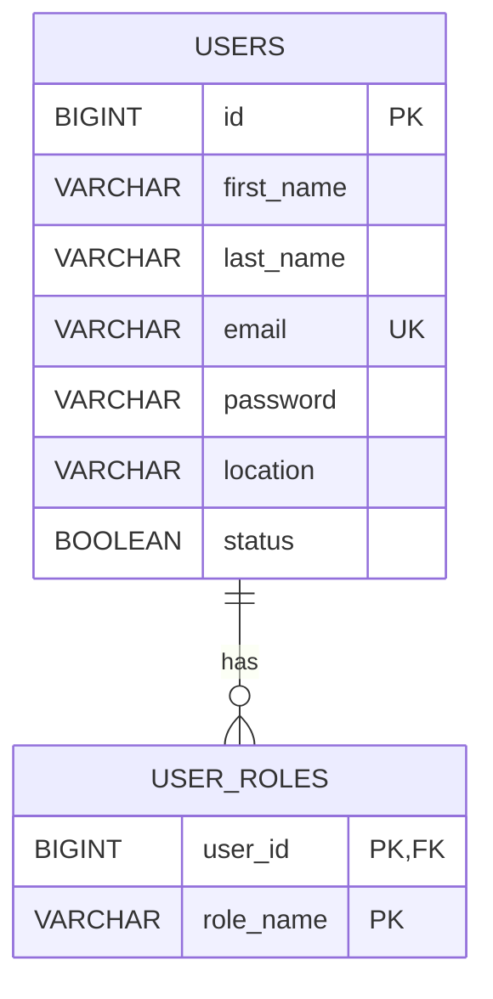

```mermaid
erDiagram


    USERS {
        BIGINT id PK
        VARCHAR first_name
        VARCHAR last_name
        VARCHAR email UK
        VARCHAR password
        VARCHAR location
        BOOLEAN status
    }

    USER_ROLES {
        BIGINT user_id PK, FK
        VARCHAR role_name PK
    }

    USERS ||--o{ USER_ROLES : "has"
```
