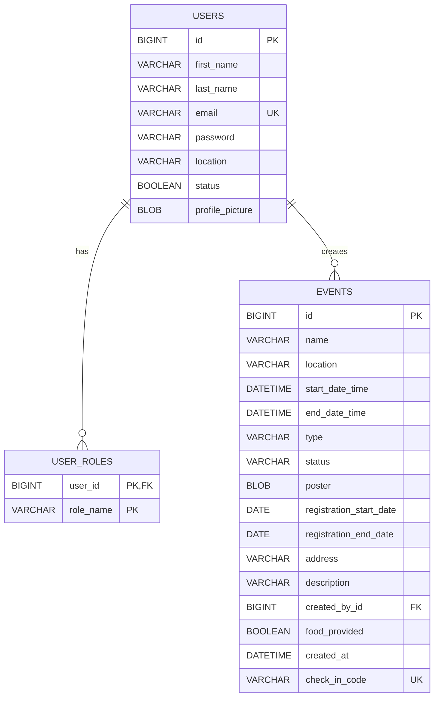

```mermaid
erDiagram
    USERS {
        BIGINT id PK
        VARCHAR first_name
        VARCHAR last_name
        VARCHAR email UK
        VARCHAR password
        VARCHAR location
        BOOLEAN status
        BLOB profile_picture
}

    USER_ROLES {
        BIGINT user_id PK, FK
        VARCHAR role_name PK
    }

    EVENTS {
        BIGINT id PK
        VARCHAR name
        VARCHAR location
        DATETIME start_date_time
        DATETIME end_date_time
        VARCHAR type
        VARCHAR status
        BLOB poster
        DATE registration_start_date
        DATE registration_end_date
        VARCHAR address
        VARCHAR description
        BIGINT created_by_id FK
        BOOLEAN food_provided
        DATETIME created_at
        VARCHAR check_in_code UK
    }

    USERS ||--o{ USER_ROLES : "has"
    USERS ||--o{ EVENTS : "creates"
```
